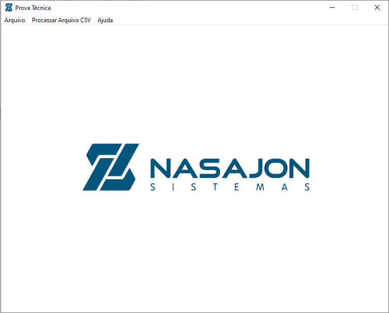
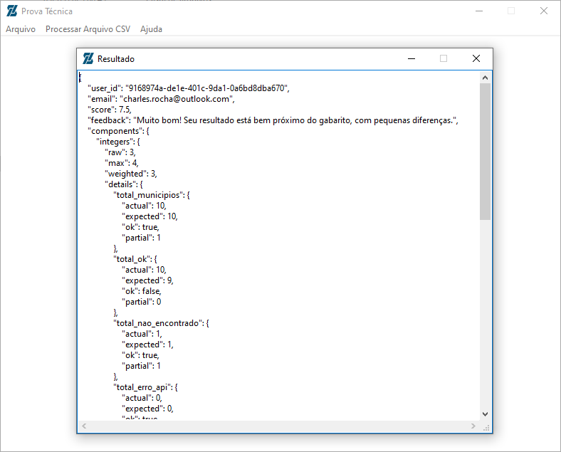

<h1 align="center">    
    
Prova Técnica Nasajon

        
	      
    	
</h1>

## Índice
- [Sobre](#-sobre)
- [Feramentas](#-ferramentas)
- [Funcionalidades](#-funcionalidades)
- [Licença](#-licença)

## 📘 Sobre

**Prova técnica para Desenvolvedor Delphi Nasajon**, geração de resultados e envio de estatísticas do IBGE.

## 🛠 Ferramentas

- [Delphi 12](https://www.embarcadero.com/br/)
- [API Rest](https://docwiki.embarcadero.com/RADStudio/Athens/en/REST_Client_Library)
- [Git](https://git-scm.com/)
- [Tortoise Git](https://tortoisegit.org/)

## 💡 Funcionalidades

- **Processar Arquivo CSV**: Ao clicar nessa opção, será lido o arquivo input.csv que está na pasta raíz da aplicação Arquivos e começara a realização de todo o processo de forma automatizada, 
passando pelos métodos CarregarArquivoCSV, CarregarMunicipiosIBGE, MontarJsonDeCorrecao, CalcularMediasPorRegiao e EnvioEstatisticasParaCorrecao. Ao final do processo será aberto um segundo
formulário exibindo o resultado da prova.

## 📄 Licença

Esse software é **free** e foi construído para realizar o **Prova técnica para Desenvolvedor Delphi Nasajon**.
